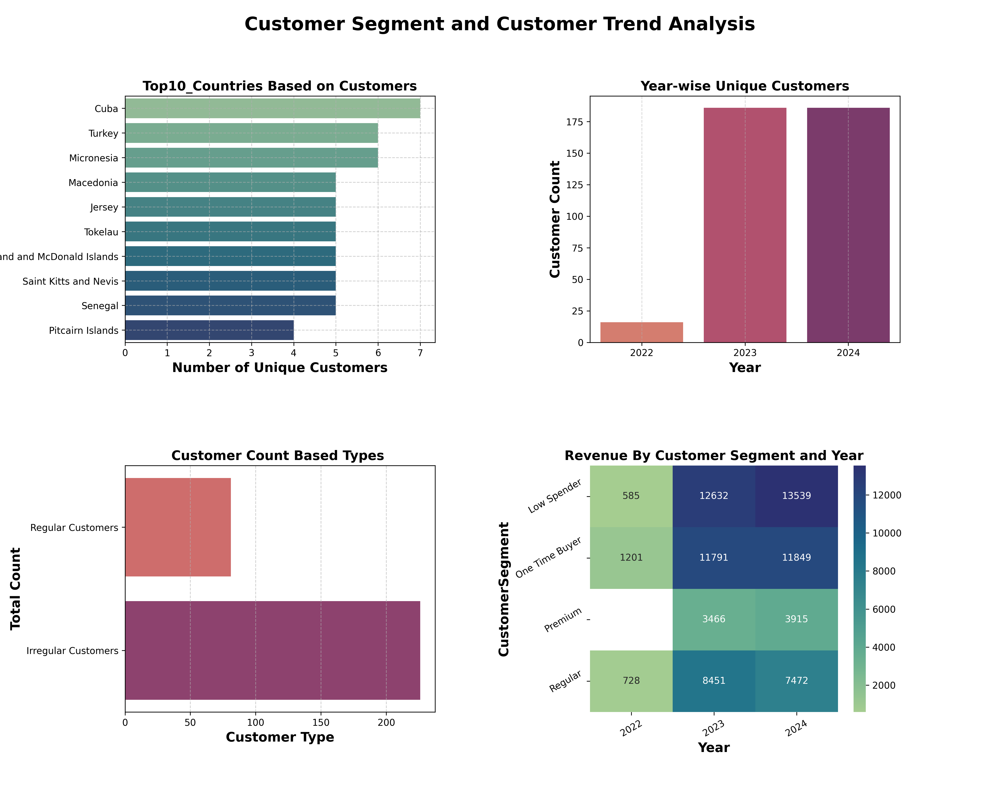

# 📚 Bookstore Sales Insights: Advanced SQL Analysis & Data Exploration

---

## 📖 Project Overview

### This project dives deep into bookstore transaction data using advanced SQL queries.  
### We explore sales patterns, customer behavior, and genre preferences.  
### It provides actionable insights based on real-world data structures.

---

## 🎯 Project Objectives

- ✅ Perform monthly and yearly sales & revenue analysis
- ✅ Identify top-selling books by genre and author
- ✅ Segment customers based on location and purchasing behavior
- ✅ Analyze borrowing patterns over different periods
- ✅ Evaluate inventory stock vs. demand for better planning
- ✅ Spot genre trends and seasonal fluctuations
- ✅ Detect customer engagement through repeat orders
- ✅ Discover revenue contribution by customer location.

---

## 🛠️ Tools Used

- 🗃️ MySQL – to write and run SQL queries for data exploration  
- 📊 Seaborn – for optional visual representation of trends  
- 📈 Matplotlib – for professional plotting (if needed)

---


## 📁 Project Structure

```
bookstore-sql-insights/
│
├── README.md                     → Project documentation and overview
├── SQL_Queries/                  → SQL scripts for all analyses
│   ├── sales_revenue_analysis.sql
│   ├── customer_segment_analysis.sql
│   ├── genre_trend_analysis.sql
│   └── borrowing_analysis.sql
├── Data/                         → Contains raw CSV files
│   ├── books.csv                 → 500 rows × 7 columns  
│   ├── orders.csv                → 500 rows × 6 columns  
│   └── customers.csv             → 500 rows × 6 columns  
├── Reports/                      
└── Visuals/                
```
## 📊 Key Insights

- 📅 Tracked monthly and yearly sales trends using order data.  
- 🧾 Identified top-selling books and high-revenue genres.  
- 👥 Segmented customers by location for regional insights.  
- 🔁 Found repeat buyers and high-frequency customers.  
- 📚 Highlighted low-stock, high-demand books for restocking.  
- 🕵️‍♀️ Observed changing genre preferences over time.  
- 💰 Analyzed key revenue drivers across products and customers.  
- 📈 Showcased consistent growth in orders and revenue.

# 📋 Basic Queries

## ✅ 1. Total Quantity Ordered
```sql
Total_Quantity_Ordered = """
SELECT SUM(Quantity) AS Total_Quantity_Ordered
FROM Orders"""
```
## ✅ 2. Total Revenue Generated
```sql
Total_Revenue = """
SELECT SUM(Total_Amount) AS Total_Revenue_Generated
FROM Orders"""
```
## ✅ 3. Orders Placed Years
```sql
Order_Years = """
SELECT DISTINCT EXTRACT(YEAR FROM Order_Date) AS years 
FROM Orders
ORDER BY years"""
```
## ✅ 4. Genre-wise Borrowed Books
```sql
Genrewise_Borrowed_Books = """
SELECT Genre,
       COUNT(Book_ID) AS Borrowed_Books
FROM Books
WHERE Book_ID IN (
    SELECT Book_ID FROM Orders
)
GROUP BY Genre"""
```

## ✅ 5. Author-wise Borrowed Books
```sql
Authorwise_Borrowed_Books = """
SELECT a.Author,
       COUNT(b.Book_ID) AS Borrowed_Books
FROM Books a
JOIN Orders b ON a.Book_ID = b.Book_ID
GROUP BY a.Author
ORDER BY Borrowed_Books DESC"""

```
## ✅ 6. Number of Customers per Year
```sql
CustomersPerYear = """
SELECT COUNT(DISTINCT Customer_ID) AS Customers_Per_Year,
       YEAR(Order_Date) AS Order_Year
FROM Orders 
GROUP BY Order_Year
ORDER BY Order_Year;
"""
```

## ✅ 7. Average Book Price
```sql
SELECT AVG(Price) AS avg_BookPrice
FROM Books;
```

## ✅ 8. Average Borrowing Quantity Per Order

```sql
SELECT AVG(Quantity_per_Order) AS AvgQuantity_Per_Order
FROM (
    SELECT Order_ID,
           SUM(Quantity) AS Quantity_per_Order
    FROM Orders
    GROUP BY Order_ID
) AS sub;
```
## ✅ 9. Top 10 Revenue Generating Books
```sql
WITH cte AS (
    SELECT Book_ID, 
           SUM(Total_Amount) AS Total_Revenue 
    FROM Orders
    GROUP BY Book_ID
    ORDER BY Total_Revenue DESC
    LIMIT 10
)
SELECT a.Book_ID, 
       b.Title, 
       a.Total_Revenue 
FROM cte AS a
JOIN Books AS b
ON a.Book_ID = b.Book_ID;
```
# Key Values
```python
AvgQuantity_Per_Order
                5.394
   Total_Quantity_ordered
                2697.0
   Total_Revenue_Generated
                75628.66
```
# 🔷 Intermediate SQL Queries

## ✅ 1. Average Borrowing Per Order
```sql
Avg_Borrowing_Per_Order = """
SELECT AVG(Quantity_per_Order) AS AvgQuantity_Per_Order
FROM (
    SELECT Order_ID,
           SUM(Quantity) AS Quantity_per_Order
    FROM Orders
    GROUP BY Order_ID
) AS sub"""
```
## ✅ 2. Monthly Borrowing Quantity in 2023
```sql
Monthly_Borrowing_2023 = """
SELECT 
    MONTHNAME(Order_Date) AS Month,
    SUM(Quantity) AS Borrowed_Quantity
FROM Orders 
WHERE EXTRACT(YEAR FROM Order_Date) = 2023
GROUP BY MONTHNAME(Order_Date), EXTRACT(MONTH FROM Order_Date)
ORDER BY EXTRACT(MONTH FROM Order_Date)
"""
Borrowing_monthly2023 = pd.read_sql(Monthly_Borrowing_2023, conn)
print("Monthly Borrowing in 2023:\n", Borrowing_monthly2023)"""
```
## ✅ 3. Lower Stock Books (Stock ≤ 10 in 2024)
```sql
Lower_Stock_Books = """
SELECT DISTINCT a.Book_ID, a.Stock AS Stock_Available
FROM Books AS a
JOIN Orders AS b ON a.Book_ID = b.Book_ID
WHERE YEAR(b.Order_Date) = 2024
  AND a.Stock IS NOT NULL 
  AND a.Stock != 0
  AND a.Stock <= 10
ORDER BY a.Stock asc"""
```
## ✅ 4. Out of Stock Books (Stock = 0 or NULL in 2024)
```sql
Out_of_Stock_Books = """
SELECT DISTINCT a.Book_ID, a.Stock AS Stock_Available
FROM Books AS a
JOIN Orders AS b ON a.Book_ID = b.Book_ID
WHERE YEAR(b.Order_Date) = 2024
  AND (a.Stock IS NULL OR a.Stock = 0)"""
```
## ✅ 5. Top 10 Most Expensive Books
```sql
Most10_expensive_Books = """
SELECT DISTINCT Book_ID,
       Title AS Book,
       Price AS Price_Of_Book 
FROM Books
ORDER BY Price_Of_Book DESC
LIMIT 10"""
```

## ✅ 6. Regular vs Irregular Customers Count
```sql
Regular_Customers_Count = """
SELECT 
    COUNT(Customer_ID) AS Regular_Customers
FROM (
    SELECT Customer_ID
    FROM Orders
    GROUP BY Customer_ID
    HAVING COUNT(DISTINCT YEAR(Order_Date)) >= 2
) AS ct

Irregular_Customers_Count = """
SELECT 
    COUNT(DISTINCT Customer_ID) AS Irregular_Customers
FROM Customers 
WHERE Customer_ID IN (
    SELECT Customer_ID
    FROM Orders
    GROUP BY Customer_ID
    HAVING COUNT(DISTINCT YEAR(Order_Date)) = 1
)
"""
```
## ✅ 7. Customers Who Ordered from 3 or More Genres
```sql
Diverse_Customers = """
SELECT a.Customer_ID,
       COUNT(DISTINCT b.Genre) AS Genre_Count
FROM Orders AS a
JOIN Books AS b ON a.Book_ID = b.Book_ID
GROUP BY a.Customer_ID
HAVING Genre_Count >= 3
"""
```

## ✅ 8. New & Most Active Customers in 2024
```sql
# 🆕 New Customers in 2024

New_Customers = """
SELECT Customer_ID,
       MIN(Order_Date) AS First_Order
FROM Orders
GROUP BY Customer_ID
HAVING YEAR(First_Order) = 2024;
"""
Newly_Customers = pd.read_sql(New_Customers, conn)
print("New Customers in 2024:\n", Newly_Customers)

# 🔝 Top 3 Most Active Customers in 2024
Most_Ordered_Customers = """
SELECT Customer_ID,
       COUNT(Order_ID) AS Total_Orders
FROM Orders
WHERE YEAR(Order_Date) = 2024
GROUP BY Customer_ID
ORDER BY Total_Orders DESC
LIMIT 3;
"""
```
# 🚀 Advanced SQL Queries

## 🚀 1. Top 3 Trending Books by Genre in 2024
```sql
Top3_TrendingBooks_ByGenre_2024 = """
WITH BookOrders AS (
    SELECT a.Book_ID, a.Genre,
           a.Title, a.Stock,
           SUM(b.Quantity) AS Total_Quantiy_Ordered,
           COUNT(DISTINCT b.Order_ID) AS Order_Count
    FROM Books AS a
    JOIN Orders AS b ON a.Book_ID = b.Book_ID
    WHERE YEAR(Order_Date) = 2024
    GROUP BY a.Book_ID, a.Genre, a.Title, a.Stock
),
RankedBooks AS (
    SELECT *,
           DENSE_RANK() OVER (PARTITION BY Genre ORDER BY Total_Quantiy_Ordered DESC) AS Genre_Rank
    FROM BookOrders
)
SELECT *
FROM RankedBooks
WHERE Genre_Rank <= 3;
"""
```

## 🚀 2. Customer Segment Revenue Analysis by Year
```sql
Customer_Segment_Revenue = """
WITH CustomerSegment AS (
    SELECT
        Customer_ID,
        COUNT(Order_ID) AS Order_Count,
        SUM(Total_Amount) AS Total_Spent,
        CASE
            WHEN SUM(Total_Amount) >= 800 THEN 'Premium'
            WHEN SUM(Total_Amount) >= 500 THEN 'Regular'
            WHEN COUNT(Order_ID) = 1 THEN 'One Time Buyer'
            ELSE 'Low Spender'
        END AS CustomerSegment
    FROM Orders
    GROUP BY Customer_ID
)
SELECT 
    SUM(b.Total_Amount) AS Customer_Revenue,
    SUM(b.Quantity) AS Quantity,
    a.CustomerSegment,
    YEAR(b.Order_Date) AS Year
FROM CustomerSegment AS a
JOIN Orders AS b ON a.Customer_ID = b.Customer_ID
GROUP BY YEAR(b.Order_Date), CustomerSegment
ORDER BY Year, CustomerSegment;
"""
```
## 🚀 3. Book Segment on Price Classification Basis

```sql
Book_Segment = """
SELECT 
    Book_ID,
    Price,
    CASE
        WHEN Price >= 30 THEN 'Premium'
        WHEN Price < 30 THEN 'Cheaper'
    END AS BookSegment
FROM Books;
"""
```

## 🚀 4. Top 10 Countries with Highest Number of Customers

```sql
Top10_Customer_Countries = """
SELECT COUNT(DISTINCT Customer_ID) AS Customer_Count,
       Country
FROM Customers
GROUP BY Country
ORDER BY Customer_Count DESC
LIMIT 10;
"""
```
## 🔄 Data Analysis Workflow - Key Points

- Performed all data querying and analysis directly in MySQL using optimized SQL queries.  
- Extracted valuable insights from the `Books`, `Orders`, and `Customers` tables through SQL commands.  
- Established a connection between Python and MySQL to fetch query results for further use.
- Created clear and informative visualizations of sales trends and customer segments using `matplotlib` and `seaborn`.  

---
## 5.Comparison of Understock,Lowerstock,OverStock Books.
```sql
Out_of_Stock_Books="""
select Distinct a.Book_ID,a.Stock as Stock_Available,
count(Distinct b.Order_ID),
sum(b.Quantity)as Quantity,
count(b.Order_ID)as Orders,
a.Price as Book_price
from Books as a
join Orders as b
on a.Book_ID=b.Book_ID
where a.Stock is null or a.Stock=0
group by a.Book_ID
"""
Stock_Out_Books=pd.read_sql(Out_of_Stock_Books,conn)


Over_Stock_Books="""
select Distinct a.Book_ID,a.Stock as Stock_Available,
sum(b.Quantity)as Quantity,
Count(year(b.Order_Date)) as Total_Order_Years ,
count(b.Order_ID)as Orders,
a.Price as Book_price
from Books as a
join Orders as b
on a.Book_ID=b.Book_ID
and a.Stock is not null and a.Stock!=0
and a.Stock >70
group by a.Book_ID
order by a.Stock asc

"""

Over_Stock=pd.read_sql(Over_Stock_Books,conn)


Lower_Stock_Books="""
select Distinct a.Book_ID,a.Stock as Stock_Available,
sum(b.Quantity)as Quantity,
count(b.Order_ID)as Orders,
a.Price as Book_price
from Books as a
join Orders as b
on a.Book_ID=b.Book_ID
and a.Stock is not null and a.Stock!=0
and a.Stock <=10
group by a.Book_ID
order by a.Stock asc

"""

Lowest_Stock=pd.read_sql(Lower_Stock_Books,conn)
conn.close()


```

```plaintext
Book_ID | Stock | Years Ordered | Quantity | Orders | Price
------------------------------------------------------------
60      | 0     | 1             | 9        | 1      | 35.14
127     | 0     | 3             | 9        | 3      | 11.66
163     | 0     | 1             | 3        | 1      | 19.11
378     | 0     | 1             | 6        | 1      | 6.01
```
## 1. Out of Stock Books

🧠 Insights:

-📉 Low order frequency (1–3 orders only).

- Still out of stock, meaning initial stock was very small.

- 📊 These books didn’t sell a lot, so stock may have never been replenished.

- ⚠️ May need better inventory planning or reorder automation.

```plaintext
Book_ID | Stock | Quantity | Orders | Price
--------------------------------------------
105     |   85  |     12    |   6    |  25.99
212     |   90  |     5     |   3    |  19.50
337     |   72  |     7     |   4    |  22.75
418     |   95  |     2     |   1    |  30.00
129     |   88  |     9     |   3    |  15.60
222     |   76  |     4     |   2    |  18.20
301     |   99  |     1     |   1    |  34.10
456     |   82  |     6     |   3    |  27.00
199     |   74  |     8     |   4    |  20.00
388     |   79  |     3     |   2    |  21.75
```
## 2. Overstocked Books (Stock > 70)

Mostly only 1–2 orders per book.

Low quantity per order (some just 1–3 units).

### 🧠 Insights:

📈 Over-purchased, but not in demand.

🛒 Needs promotion, or stop ordering those not performing.

```plaintext
Book_ID | Stock | Quantity | Orders | Price
--------------------------------------------
390     |   1   |     15    |   6    |  13.99
287     |   2   |     22    |   9    |  10.50
128     |   1   |     18    |   7    |  11.25
145     |   2   |     25    |   8    |  16.40
319     |   1   |     20    |   6    |  12.00
204     |   2   |     17    |   7    |  14.30
277     |   1   |     19    |   5    |  15.80
342     |   2   |     21    |   9    |  11.90
411     |   1   |     23    |   6    |  10.75
151     |   2   |     24    |   8    |  13.60
```
## 3. Low Stock (Stock ≤ 10)

### Books like:

Book_ID 307, 288, 447, etc., have high orders (3 orders) and quantities (e.g., 23, 18, etc.).


🧠 Insights:

🔥 These are hot-selling books, about to run out of stock.

✅ Good candidates for restocking quickly.

📈 Demand is clear from multiple years ordered and higher quantities.


## Key Points
🔸 Median stock is moderate, but some books have very high stock.

🎯 Outliers present — a few books are extremely overstocked.

🛒 These books may not be selling well, leading to inventory pile-up.


💡 Need better demand forecasting or promotional strategies for these titles.
## 1.Sales and Revenue Analysis

**Objective:** Analyze yearly sales revenue and quantity sold.
**Output:**
- 📦 Extracted yearly total revenue and quantity sold from the `Orders` table using SQL aggregation.
- 📊 Plotted the results to visualize:
  - Annual revenue trends.
  - Yearly sales quantity.
  - Comparison between revenue and quantity sold.
  - Revenue share per year using a pie chart.
## Sql Code
```sql
SELECT YEAR(Order_Date) AS Year, 
       SUM(Total_Amount) AS Yearly_Revenue, 
       SUM(Quantity) AS Yearly_SalesQuantity
FROM Orders
GROUP BY YEAR(Order_Date)
ORDER BY Year
```
## Visual Code
---
```python
plt.figure(figsize=(10, 14),dpi=300)

plt.subplot(2,2,1)
sns.lineplot(data=Yearly_Revenue_Quantity, x='Year', y='Yearly_Revenue',
             marker='o', color='purple')
plt.grid(True, linestyle='--', linewidth=1, alpha=0.7)
plt.title('Revenue Generated Per Year', fontsize=12, fontweight='heavy', fontstyle='italic')
plt.xlabel('Year', fontsize=12, fontweight='heavy')
plt.ylabel('Revenue', fontsize=12, fontweight='heavy')
plt.xticks(Yearly_Revenue_Quantity['Year'],rotation=20)

plt.subplot(2,2,2)
sns.barplot(data=Yearly_Revenue_Quantity, x='Year', y='Yearly_SalesQuantity',
            palette='flare', alpha=0.8)
plt.title('Quantity Sold Per Year', fontsize=12, fontweight='heavy', fontstyle='italic')
plt.xlabel('Year', fontsize=12, fontweight='heavy')
plt.ylabel('Sales Quantity', fontsize=12, fontweight='heavy')
plt.xticks(rotation=20)


plt.subplot(2,2, 3)
sns.scatterplot(data=Yearly_Revenue_Quantity, x='Yearly_SalesQuantity', y='Yearly_Revenue', hue='Year', palette='flare', s=200)
plt.title('Comparison of Quantity Sold and Revenue Earned', fontsize=12, fontweight='heavy', fontstyle='italic')
plt.xlabel('Sales Quantity', fontsize=12, fontweight='heavy')
plt.ylabel('Total Revenue', fontsize=12, fontweight='heavy')
plt.legend(title='Year')

plt.suptitle("Annual Wise Sales and Revenue Trend", fontsize=20, fontweight='heavy')
plt.subplots_adjust(hspace=0.4)

plt.subplot(2, 2, 4)
plt.pie(Yearly_Revenue_Quantity['Yearly_Revenue'], labels=Yearly_Revenue_Quantity['Year'],
        colors=['pink','orange','coral'], autopct='%1.0f%%', shadow=True,radius=1.5,
        textprops={'fontsize': 12, 'color': 'black', 'weight': 'bold'},
        wedgeprops={'edgecolor': 'black', 'linewidth': 2,'width':0.8})
plt.title('Revenue Contribution by Year', fontsize=12, fontweight='heavy', fontstyle='italic')
plt.legend(title='year',loc='lower right')


plt.tight_layout(rect=[1,1,1,3])  
plt.suptitle("Annual Wise Sales and Revenue Trend", fontsize=20, fontweight='heavy')
plt.subplots_adjust(hspace=0.5, wspace=0.5)
plt.savefig('Sales And Revenue Analysis.png')


plt.show()
```


## 2.📚 Genre-Wise Borrowing Trends Analysis Over the Years

- Extracted genre-wise data from the Orders and Books tables using SQL:
- Fetched distinct book count and total orders for each genre per year.


Visualized the insights using two plots:

📊 Bar Plot showing unique books borrowed by genre, across years.

📈 Line Plot showing total number of orders placed per genre, over time.
## Sql Code
```sql
select b.Genre,
       year(a.Order_Date) as Year,
       count(Distinct a.Book_ID) as Book_Count,
       count(Distinct a.Order_ID) as Total_Orders
from Orders as a
join Books as b
on a.Book_ID = b.Book_ID
group by year(Order_Date), b.genre
order by Book_Count;
```
## Visual Code
```Python
# Matplotlib & Seaborn Visualization
plt.figure(figsize=(8,10), dpi=300)

# Bar Plot - Unique Books by Genre
plt.subplot(2,1,1)
sns.barplot(data=Genre_Books_Count,
x='Genre', y='Book_Count', hue='Year',
palette='Dark2', saturation=0.75)
plt.title("Unique Book Borrowings by Genre Over the Years")

# Line Plot - Orders by Genre
plt.subplot(2,1,2)
sns.lineplot(data=Genre_Books_Count, x='Genre',
 y='Total_Orders', hue='Year', style='Year',
 palette='flare')
plt.title("Total Orders Placed Genre-Wise Over the Years")

plt.tight_layout()
plt.savefig('Genres Trend.png')
plt.show()
```


## 3. 🧑‍🤝‍🧑 Customer Segment and Trend Analysis

- 1.Extracted only customers who placed at least one order by joining the Customers and Orders tables.
- 2.Queried year-wise count of unique customers to analyze growth over time.
- 3.Retrieved Top 10 countries based on total number of unique customers.

**1.Identified:**

- 1. Regular Customers: who placed orders in 2 or more different years.
- 2.Irregular Customers: who placed orders in only one year.


**2.Segmented customers into 4 categories based on their total spend and order count:**

🏆 Premium: Spent ≥ 800

🔁 Regular: Spent ≥ 500

☝️ One Time Buyer: Only 1 order

🪙 Low Spender: Everyone else


**3.Aggregated segment-wise revenue and quantity sold for each year using CTE and joins.**

**Visualized:**

📊 Top 10 countries by customer count using bar chart.
📈 Year-wise unique customers using bar chart.
🧮 Comparison of Regular vs Irregular customers using horizontal bar chart.
🔥 Revenue by Customer Segment across years using heatmap.


**4.Saved final visualization as CustomerSegment.png.**
## Sql Code
```sql

UniqueCustomers_Count="""
select count(Distinct a.Customer_ID)as
Customer_Count,
year(b.Order_Date)as Year
From Customers as a
join Orders as b
on a.Customer_ID=b.Customer_ID
group by year(b.Order_Date)"""

Yearly_UniqueCustomers=pd.read_sql(UniqueCustomers_Count,conn)
print(Yearly_UniqueCustomers)

Top10_Customer_Countries="""
select count(Distinct Customer_ID)as 
Customer_Count,Country
from Customers
Group by Country
order by Customer_Count desc
limit 10"""
CustomerCount_CountryTop10=pd.read_sql(Top10_Customer_Countries,conn)
print(CustomerCount_CountryTop10)

Regular_Customers_Count="""
select 
count(Customer_ID)
as Regular_Customers
from (
select  Customer_ID
from Orders
Group by Customer_ID
Having count(Distinct year(Order_Date))>=2
)ct"""

Regular_Customers=pd.read_sql(Regular_Customers_Count,conn)
print(Regular_Customers)

Irregular_Customers_Count = """
SELECT 
    COUNT(DISTINCT Customer_ID) AS Irregular_Customers
FROM Customers 
WHERE Customer_ID IN (
    SELECT Customer_ID
    FROM Orders
    GROUP BY Customer_ID
    HAVING COUNT(DISTINCT YEAR(Order_Date)) = 1
)
"""
Irregular_Customers=pd.read_sql(Irregular_Customers_Count,conn)
print(Irregular_Customers)

Customer_Segment_Revenue="""
with CustomerSegment as (
select
Customer_ID,
count(Order_ID)as Order_Count,
sum(Total_Amount) AS Total_Spent,
case
        when sum(Total_Amount) >= 800 then 'Premium'
        when sum(Total_Amount) >= 500 then 'Regular'
        when count(Order_ID)=1
        then 'One Time Buyer'
        else 'Low Spender'
end AS CustomerSegment
from Orders
group by Customer_ID)

select sum(b.Total_amount) as Customer_Revenue,
sum(b.Quantity)as Quantity,
a.CustomerSegment,
year(b.Order_Date)as Year
from CustomerSegment as a
join Orders as b
on a.Customer_ID=b.Customer_ID
group by year(b.Order_Date),CustomerSegment
order by Year,CustomerSegment
"""
Customer_Categories_Revenue= pd.read_sql(Customer_Segment_Revenue,conn)
print(Customer_Categories_Revenue)

regular=Regular_Customers['Regular_Customers'][0]
Irregular=Irregular_Customers['Irregular_Customers'][0]

categories = ['Regular Customers', 'Irregular Customers']
counts = [regular, Irregular]

```
## Visual Code
```python
plt.figure(figsize=(15,12),dpi=300)

plt.subplot(2,2,1)

sns.barplot(data=CustomerCount_CountryTop10,
            x='Customer_Count',
            y='Country',
            palette='crest')

plt.title('Top10_Countries Based on Customers', fontsize=14, fontweight='heavy')
plt.xlabel('Number of Unique Customers', fontsize=14, fontweight='heavy')
plt.ylabel('Country', fontsize=14, fontweight='heavy')
plt.grid(True, linestyle='--', alpha=0.6)


# Subplot 1: Lineplot
plt.subplot(2,2,2)

sns.barplot(data=Yearly_UniqueCustomers, 
            x='Year', 
            y='Customer_Count', 
            palette='flare',
            width=0.8)

plt.title('Year-wise Unique Customers', fontsize=14, fontweight='heavy')
plt.xlabel('Year', fontsize=14, fontweight='heavy')
plt.ylabel('Customer Count', fontsize=14, fontweight='heavy')

plt.grid(axis='x', linestyle='--', alpha=0.5)


plt.subplot(2,2,3)

sns.barplot(y=categories, x=counts, palette='flare')
plt.title('Customer Count Based Types ', fontsize=14, fontweight='bold')
plt.xlabel('Customer Type',fontsize=14, fontweight='heavy')
plt.ylabel('Total Count',fontsize=14, fontweight='heavy')

plt.grid(axis='x', linestyle='--', alpha=0.6)

plt.subplot(2,2,4)

pivot = Customer_Categories_Revenue.pivot(index='CustomerSegment', columns='Year', values='Customer_Revenue')
sns.heatmap(pivot, annot=True, cmap='crest', fmt=".0f")
plt.title("Revenue By Customer Segment and Year",fontsize=14, fontweight='heavy')
plt.xlabel('Year',fontsize=14, fontweight='heavy')
plt.ylabel('CustomerSegment',fontsize=14, fontweight='heavy')
plt.xticks(rotation=30)
plt.yticks(rotation=30)

plt.tight_layout(rect=[1,1,1,3])  # Adjust spacing to make room
plt.suptitle("Customer Segment and Customer Trend Analysis",
fontsize=20,fontweight='heavy')
plt.subplots_adjust(hspace=0.5, wspace=0.5)
plt.savefig('CustomerSegment.png')
```


plt.show()


## 4. 📈 Borrowing Trend Analysis
1.Extracted top 3 trending books by genre in 2024 based on total quantity ordered .

2.Extracted monthly borrowing event counts for 2024 from Orders.
## Visuals
1.Created a bar plot comparing stock vs total quantity ordered for the top 3 books per genre.

2.Created a line plot showing the monthly borrowing events trend in 2024.
## Sql Code
```sql
Top3_TrendingBooks_ByGenre_2024="""
with BookOrders as(
select a.Book_ID ,a.Genre,
a.Title,a.Stock,
sum(b.Quantity)as Total_Quantiy_Ordered,
Count(Distinct b.Order_ID )as
Order_Count
From Books as a
Join Orders as b
on a.Book_ID=b.Book_ID
where year(Order_Date)=2024
group by a.Book_ID,a.Genre,a.Title,a.Stock),

RankedBooks AS (
    SELECT *,
           Dense_rank()OVER (PARTITION BY Genre ORDER BY  Total_Quantiy_Ordered  DESC) AS Genre_Rank
    FROM BookOrders
)
SELECT *
FROM RankedBooks
WHERE Genre_Rank <=3

"""
Top3Books_PerGenre_2024=pd.read_sql(Top3_TrendingBooks_ByGenre_2024
,conn)


Monthly_Borrowing_2024 = """
SELECT 
    MONTHNAME(Order_Date) AS Month,
    COUNT(DISTINCT Order_ID) AS Borrowing_Events_2024
FROM Orders 
WHERE EXTRACT(YEAR FROM Order_Date) = 2024
GROUP BY MONTHNAME(Order_Date), EXTRACT(MONTH FROM Order_Date)
ORDER BY EXTRACT(MONTH FROM Order_Date)
"""
Monthly_Analysis2024 = pd.read_sql(Monthly_Borrowing_2024, conn)
```
## Python Code
```python
plt.figure(figsize=(10, 15),dpi=300)

df_melted = pd.melt(
    Top3Books_PerGenre_2024,
    id_vars=['Book_ID'], 
    value_vars=['Stock', 'Total_Quantiy_Ordered'],
    var_name='Type', 
    value_name='Value'
)
plt.subplot(2,1,1)
sns.barplot(data=df_melted, x='Book_ID', y='Value', hue='Type', palette='Set2')

plt.title('Top 3 Books of Each Genre on Quantity Basis (2024)',fontsize=14, fontweight='heavy')
plt.xticks(rotation=60)

plt.ylabel('Quantity Ordered vs Stock Available',fontsize=14, fontweight='heavy')
plt.xlabel('Book Name',fontsize=14, fontweight='heavy')
plt.legend()

plt.subplot(2,1,2)

plt.plot(
    Monthly_Analysis2024['Month'],
    Monthly_Analysis2024['Borrowing_Events_2024'],
    marker='o',
    color='teal'
)
plt.title('Monthly Borrowing Events in 2024', fontsize=14, fontweight='bold')
plt.xlabel('Month', fontsize=14,fontweight='heavy')
plt.ylabel('Number of Orders ', fontsize=14,fontweight='heavy')
plt.xticks(rotation=30)
plt.grid(True)

plt.tight_layout(rect=[1,1,1,3])  
plt.suptitle("Borrowing Trend Analysis",
fontsize=20,fontweight='heavy')
plt.subplots_adjust(hspace=0.5, wspace=0.5)
plt.savefig('Borrowing Trend.png')

plt.show()
```


## 📌 Recommendations

Reduce purchase of overstocked books with low demand.

Restock books that are out of stock but in high demand.

Monitor past order quantity to plan stock effectively.

Set alerts for books with critically low stock.

Use discounts/offers to clear excess inventory.

Revisit pricing of books with low sales.

Avoid overstocking slow-moving titles.

Focus on books with higher order frequency.

Manage stock based on customer demand patterns.

Promote top-selling books more aggressively.


### 📍 Market & Customer Insights

📈 We've identified 10 countries with more consumers — focus marketing and supply in these regions to create potential loyal customers.

🌎 Explored data of diverse customers — analyze the genres they prefer and recommend similar books to increase engagement.

💰 We have a list of top revenue-generating customers — provide exclusive offers or personalized messages to maintain their interest.

🔍 Monitor popular genres based on order history to ensure you're offering what readers love.

## 📘 Conclusion
With each query, insights compiled,
Customer trends and genres profiled.
From stock alerts to revenue streams,
Data unfolded like structured dreams.
A clean script closes — analysis complete.

## Author

# SHAHISTA SHAIKH
# Contact me:
shaikhshahi326@gmail.com

