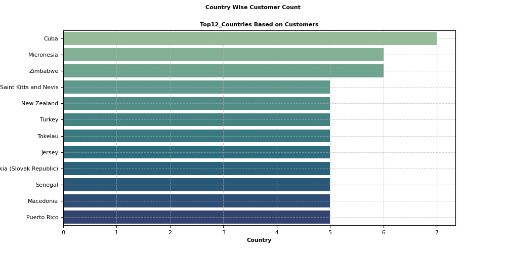

# 📚 Bookstore Sales Insights: Advanced SQL Analysis & Data Exploration

---
## 📌 Problem Statement

- In today’s competitive  retail environment, understanding sales performance, customer behavior, inventory efficiency, and hidden data patterns is crucial for business growth.
- Our fictional Bookstore has been experiencing inconsistent revenue, unexplained stockouts, and uncertain customer retention trends.
- Despite collecting  amounts of data across orders, customers, books, and inventory, decision-makers struggle to turn this data into actionable insights.
  
## 🎯 Project Objectives

- ✅ Perform monthly and yearly sales & revenue analysis
- ✅ Identify top-selling books by genre and author
- ✅ Segment customers based on location and purchasing behavior
- ✅ Analyze borrowing patterns over different periods
- ✅ Evaluate inventory stock vs. demand for better planning
- ✅ Spot genre trends and seasonal fluctuations
- ✅ Detect customer engagement through repeat orders
- ✅ Discover revenue contribution by customer location.

---

## 🛠️ Tools Used
MySQL – to write and run SQL queries for data exploration
Seaborn – for optional visual representation of trends
Matplotlib – for professional plotting (if needed)
stattools
Pandas
Numpy


---
## Project Objective
- This project aims to analyze the bookstore’s data through SQL and Python to extract more 30 high-impact business insights that support data-driven decision-making. The analysis is divided into four key areas:

- Sales Performance – Understand revenue trends, top-selling products, and growth patterns.

- Customer Behavior – Segment customers by spending and loyalty to improve retention.

- Inventory Management – Optimize stock by identifying overstocked, understocked, and dead items.

- Deep Data Insights – Detect outliers, trends, and anomalies using advanced EDA techniques.

## 📁 Project Structure

```
bookstore-sql-insights/
│
├── README.md                     → Project documentation and overview
├── SQL_Queries/                  → SQL scripts for all analyses
│   ├── sales_revenue_analysis.sql
│   ├── customer_segment_analysis.sql
│   ├── genre_trend_analysis.sql
│   └── borrowing_analysis.sql
├── Data/                         → Contains raw CSV files
│   ├── books.csv                 → 500 rows × 7 columns  
│   ├── orders.csv                → 500 rows × 6 columns  
│   └── customers.csv             → 500 rows × 6 columns  
├── Reports/                      
└── Visuals/                
```

# Key Values
```python
AvgQuantity_Per_Order
                5.394
   Total_Quantity_ordered
                2697.0
   Total_Revenue_Generated
                75628.66
```

# 📋 Basic Queries
## Loading Data File and Building Connection
```python
import numpy as np 
import pandas as pd
import seaborn as sns 
import matplotlib.pyplot as plt
import mysql.connector
import warnings
warnings.filterwarnings('ignore')```

```python
conn = mysql.connector.connect(
    host="localhost",
    user="root",
    password="shahista123@dataanalyst456",
    database="books",
    charset='utf8mb4',
    collation='utf8mb4_general_ci'
)
cursor=conn.cursor()
```
## Exploaratory Data Analysis(EDA)
## Code 1:Total Unique Books Available
```python
TotalUniqueBooks="""
select count(Distinct Book_ID)as Book_Count
from Books """
pd.read_sql(TotalUniqueBooks,conn)
```
## Code 2: List of Distinct Book Genres
```python
DistinctGenres= "Select Distinct(Genre) from Books"
pd.read_sql(DistinctGenres,conn)
```
## Code 3 : Count Of Distinct Authors
```python
DistinctAuthors="Select Count(Distinct Author)from Books"
pd.read_sql(DistinctAuthors,conn)
```
## Code 4: Average Quantity Ordered
```python
AverageQuantityOrdered="""
select avg(Quantity)as Avg_Quantiy_Ordered
from Orders"""
pd.read_sql(AverageQuantityOrdered,conn)
```
## Code 5: Distinct Order Years
```python
Order_Years="""
select Distinct
(extract(year from Order_Date))as years from Orders
Order by years"""
pd.read_sql(Order_Years,conn)
```
## Code 6: Total Sales Generated Per Year
```python
SalesPerYear="""
select year(Order_Date)as Year,sum(Total_Amount)as Total_Sales
from Orders
group by year(Order_Date)
""" 
pd.read_sql(SalesPerYear,conn)
```
## Code 7: Total Quantity Ordered
```python
Total_Quantity_Ordered="""
select sum(Quantity)as Total_Quantity_ordered
from Orders"""
pd.read_sql(Total_Quantity_Ordered,conn)
```
## Code 8: Unique Cities Count
```python
City_Count="""select count(Distinct City)as Cities
from Customers"""
pd.read_sql(City_Count,conn)
Code 9: Average Book Price Calculation
AvgBookPrice="""select avg(price)as Avg_BookPrice
from Books"""
pd.read_sql(AvgBookPrice,conn)
```
## Code 10: Total Revenue Generated
```python
Total_Revenue="""select sum(Total_Amount)as Total_Revenue_Generated
from Orders"""
pd.read_sql(Total_Revenue,conn)
```
## Code 11: One Time Customers
```python
One_Time_Customers = """
SELECT
COUNT(Distinct Customer_ID) AS One_Time_Customers
FROM Customers
WHERE Customer_ID IN (
SELECT Customer_ID
FROM Orders
GROUP BY Customer_ID
HAVING COUNT(Distinct Order_ID) = 1
)
"""
pd.read_sql(One_Time_Customers,conn)
```
## Code 12: Count of Repeated Customers
```python
Repeated_Customers = """
SELECT 
    COUNT(Distinct Customer_ID) AS Repeated_Customers
FROM Customers 
WHERE Customer_ID IN (
    SELECT Customer_ID
    FROM Orders
    GROUP BY Customer_ID
    HAVING COUNT(Distinct Order_ID) > 1
)
"""
pd.read_sql(Repeated_Customers,conn)
```
- In Total from 307 Customers the repeadted Customers are 139 and one time customers are 168.
- that means business in alll the aspects failed to build stong engagement with buyers.
- 
## Code 13: Most Recent Customer Details
```python
Recent_Customer="""
select a.Customer_ID ,
a.Order_Date,
b.Name,
b.Country
,b.City
from Orders as a
join Customers as b
on a.Customer_ID=b.Customer_ID
order by a.Order_Date Desc
limit 5"""
pd.read_sql(Recent_Customer, conn)
```
## Code 14: Distinct Country Count
```python
Total_Countries="Select count(Distinct Country)from Customers"""
pd.read_sql(Total_Countries,conn)
```
## Code 15: Churned/Inactive Customers in the Latest Year 2024
```python
Churned_Customers="""With Churned as (select Customer_ID as Customer,
Max(Order_Date)as Last_Order
from Orders
Group by Customer_ID
Having year(Last_Order)<2024)
 select count(Customer)as churned_Customers
 from Churned"""
pd.read_sql(Churned_Customers, conn)
```
## Code 16: Total Orders Placed per Year
```python
YearlyOrders=""" SELECT count(Distinct Order_ID)as Orders
                 from orders 
                 group by year(Order_Date)"""
pd.read_sql(YearlyOrders,conn)
```
## Visualisations & Interpretation of Output/Results
- Visuals such as bar charts, line graphs, and pie charts were used to present trends clearly.

- Sales, customer segments, and genre-wise performance were visualized for better insights.

- Charts helped identify seasonal trends, top-performing books, and customer behavior.

- Understock and overstock patterns were highlighted using conditional formatting and counts.

- Year-wise comparison showed clear growth in low spender segments and one-time buyers.

- Interpretations drawn from visuals guided meaningful business recommendations and actions.

## Distribution of Price 
```python
Price="select Price from Books"
df=pd.read_sql(Price,conn)

plt.figure(figsize=(7,5))
sns.histplot(data=df,x='Price',bins=20,kde=True)
plt.savefig('Price Distibution')
```

- There is the variability in the price range some books are low priced and some are high priced.
- which price segment generates more revenue or having more orders is need to see in detail.
- which will gonna help in understanding customer prefeences as well as overall peformance insights

## Segmenting Books on the basis of Books Price into 2 Categories High Priced and Low priced.
```python
# Adding Column
BooksCategoy= """ Alter table Books 
                  Add column Books_Category varchar(20)"""
cursor.execute(BooksCategoy)
conn.commit()
```
```python
# Updating Column
BooksSegmentUpdate= """ UPDATE Books 
                  SET  Books_Category =  case
                  when price >27 then 'High Priced'
                  else 'Low Priced'
                  END """
cursor.execute(BooksSegmentUpdate)
conn.commit()
```
- So as the Average Book Price is (27.36744) based on this Price books will categories in two segments High priced and Low Priced Books.
- Where if the Books price would be less than average will consider as Low Priced and if > More than average then will be treated as High Priced.

## 1.Overall Quantity Ordered from Each Category? VS Overall Revenue Generated from Each Category?
```python
# Executing Query 
BooksQuantity =""" SELECT a.Books_Category,sum(b.Quantity ) as Quantity_Ordered
                        FROM Books as a
                        join Orders as b
                        on a.Book_ID= b.Book_ID
                        group by a.Books_Category"""

Data1=pd.read_sql(BooksQuantity ,conn)

BooksRevenue=""" SELECT a.Books_Category,sum(b.Total_Amount) as Revenue
                        FROM Books as a
                        join Orders as b
                        on a.Book_ID= b.Book_ID
                        where year(b.Order_Date)= 2024
                        group by a.Books_Category
                        """
Data2=pd.read_sql(BooksRevenue,conn)

# Printing Query Result
print(Data1)
print(Data2)
plt.figure(figsize=(10,5))
plt.subplot(1,2,1)
sns.barplot(data=Data1,x= 'Books_Category',y='Quantity_Ordered',width=0.3,color='Orange')
plt.title("Books Category-Wise Quantity Comparison",fontsize=10,fontweight='bold')

plt.subplot(1,2,2)
sns.barplot(data=Data2,y='Revenue',x= 'Books_Category',width=0.3,color='Red')
plt.title("Books Category-Wise Revenue Comparison",fontsize=10,fontweight='bold')

plt.savefig('Quantity and Revenue Comparison')

```

## 2. Which Books_Category is Customer Preference ? Which Books_Category has Placed More Orders?
```python
BooksOrders=""" SELECT a.Books_Category,Count(b.Order_ID)as Orders
                        FROM Books as a
                        join Orders as b
                        on a.Book_ID= b.Book_ID
                        group by a.Books_Category"""
Data=pd.read_sql(BooksOrders,conn)
print(Data)

plt.figure(figsize=(4,4))
sns.barplot(data=Data,y='Orders',x= 'Books_Category',width=0.3,color='Green')
plt.title("Books Category-Wise Orders Comparison")
plt.savefig('Orders Comparison')
```

## 3. Is there a correlation between Quantity and Revenue ? By the Increase in Quantity Can we Expect to generate more Revenue?
```python
RevenueandOrders="SELECT Quantity ,Total_Amount as Revenue from Orders"
Data=pd.read_sql(RevenueandOrders,conn)
df=pd.DataFrame(Data)
plt.figure(figsize=(8,4))
sns.scatterplot(data=df,x='Revenue',y= 'Quantity')
plt.title("Books_Category wise Ordered Quantity Comparison")
plt.savefig('Quantity and Revenue Corelation')
```
```python
Quantity_RevenueCorr=df[['Quantity','Revenue']].corr()
Quantity_RevenueCorr
```
```python
print('Correlation coefficient\n------------')
print('Quantity_RevenueCorr:',round(Quantity_RevenueCorr.values[0,1],2))
```
```plaintext
Correlation coefficient
------------
Quantity_RevenueCorr: 0.73
```

- So Correlation Between Quantity and Revenue is(0.73) is a positive correlation is their.
- ((0.73) is Not really a Very strong Correlation but Good Correlation is there.
- So,yes by the increase in Sales More Quantity Business can Expect Generate More Revenue.


##  4.What Are the Top 3 Genres in the sense of Orders?
```python
Top3Genre_OrdersWise=""" SELECT a.Genre,Count(b.Order_ID)as Orders
                         from Books as a
                         join Orders as b
                         on a.Book_ID=b.Book_ID
                         group by a.Genre
                         Order by Orders desc
                         limit 3"""
pd.read_sql(Top3Genre_OrdersWise,conn)
```
## 5.What Are the Top 3 Genres in the sense of Revenue?
```python
Top3Genre_SalesWise=""" SELECT a.Genre,sum(b.Total_Amount)as Revenue
                         from Books as a
                         join Orders as b
                         on a.Book_ID=b.Book_ID
                         group by a.Genre
                         Order by Revenue desc
                         limit 3"""
pd.read_sql(Top3Genre_SalesWise,conn)
```
- Top 3 Performing Genres are Science Fiction,Mystery and Fancy in the case of Orders with Placed Orders (81,83,84).
- on the Other side, Mystery and Science fictions also Comes under Top 3 Revenue generating Genres,
- where Mystery genre is on the 2 nd position in both orders and Sales Case.
- But Science fiction has lost its Position and From 1 st position directly came to 3 rd Position in the Case of Generating Revenue.
- Even if the Romance Category is not in the list of Top 3 Ordered Genres ,then also Romance is the Top 1 Revenue Generating Genre.
- Romance Genre is Helping Business to Generate More income ,so we Sholud go with Romance Genre.
- and Science Fiction is showing Popularity among Customers we should Provide Some Extra Benefits or Offers On this Genre to Builld Loyal Customers For the Business.
- Total 6 Genre Books are there But,only this 4 Genres perfoming Good.
- other 2 Genres Need More Marketing to shift interst of customers to those genres also.

## 6.Worst Performing Genre Placing Orders? /Worst Performing Genre Earning Revenue?
```python
worstEarningGenre="""SELECT a.Genre,sum(b.Total_Amount)as Revenue
                         from Books as a
                         join Orders as b
                         on a.Book_ID=b.Book_ID
                         group by a.Genre
                         Order by Revenue asc
                         limit 1"""
pd.read_sql(worstEarningGenre,conn)
```
```plaintext
	Genre	Revenue
0	Fiction	7271.22
```
```python
LessOrderedGenre=""" SELECT a.Genre,Count(b.Order_ID)as Orders
                         from Books as a
                         join Orders as b
                         on a.Book_ID=b.Book_ID
                         group by a.Genre
                         Order by Orders asc
                         limit 1"""
pd.read_sql(LessOrderedGenre,conn)
```
```plaintext
Genre	Orders
0	Fiction	46
```
- Fiction Genre is the lowest performing Genre ,in the case of both Generating Orders and Generating Revenue.
## 7.Was there a huge Differenciation in the performance of Good VS Bad performing Genres?
```python
LessOrderedGenre=""" SELECT a.Genre,Count(b.Order_ID)as Orders,Year(b.Order_Date)as Year
                         from Books as a
                         join Orders as b
                         on a.Book_ID=b.Book_ID
                         group by a.Genre,Year(b.Order_Date)
                         Order by Genre,Year 
                         """

GenreComparison=pd.read_sql(LessOrderedGenre,conn)
pivot= GenreComparison.pivot(index='Genre',columns='Year',values='Orders')
plt.figure(figsize=(12,5))

sns.heatmap(pivot, annot=True, cmap='Greens', fmt=",.0f", linewidths=0.5, linecolor='white')

plt.savefig('Genre Orders Comparison')
```

- Here From the Top Orders Placing data we have selected Genres and then Compared with the Fiction Genre to understand Why there is a That much difference in the Count of Orders between this Top Orders Placing Genres VS Fiction Genre.
- In the Initial Year of the Business Fiction was on on top 1 but after Years it Failed to compete with other genres and match thier level,as it can be because shift of Customer Preference.
- Where as Biography genre is on second last position.
- There is huge diffeence between this low Performing genres vs Better performing genres.
- where Maximum Orders Count of Biography and Fiction is (25 to 27) only.
- On ther Other Hand, Other Genres maximum count ranges Between (38 to 49) which a huge big number as compared those 2 Low Performing genres.
## 8.What are the Top 12 Countries with Customer Count?
```python
Top12_Customer_Countries="""
select count(Distinct Customer_ID)as 
Customer_Count,Country
from Customers
Group by Country
order by Customer_Count desc
limit 12"""
CustomerCount_CountryTop12=pd.read_sql(Top12_Customer_Countries,conn)

plt.figure(figsize=(10,5))
```

```python
sns.barplot(data=CustomerCount_CountryTop10,
            x='Customer_Count',
            y='Country',
            palette='crest')

plt.title('Top12_Countries Based on Customers', fontsize=8, fontweight='bold')
plt.ylabel('Number of Unique Customers', fontsize=8, fontweight='bold')
plt.xlabel('Country', fontsize=8,fontweight='bold')
plt.xticks(fontsize=8)
plt.yticks(fontsize=8)
plt.grid(True, linestyle='--', alpha=0.6)
plt.suptitle('Country Wise Customer Count',fontsize=8, fontweight='heavy')
plt.tight_layout(rect=[0,0,0,1])
plt.savefig('Country')
plt.show()
```

## 9.How Many Countries are their where customer count is very low?How the Overall Customer Engament in the Business?

### Countries with Customer Count 1
```python
Country_Count="""Select Count(Country) as Countries_Count
from Customers
where Country in (Select Country  
                  from Customers
                  group by Country
                  having Count(Distinct Customer_ID)=1)
                """
pd.read_sql(Country_Count,conn)
```
```plaintext
Countries_Count
0	65
```
### Distinct Country Count
```python
Total_Countries="Select count(Distinct Country)from Customers"""
pd.read_sql(Total_Countries,conn)
```
```plaintext
count(Distinct Country)
0	215
```
- The business is now after 3 years also in the intial stage only.
- The business has spread eveywhere but not that much awareness is there ,we are placing and getting Customers from the 215 Countries total.
- But from the 215 countries (65) Countires are their where the customer_Count is only 1
- Needs a Stong Marketing of the Business and Awareness about the products among the Buyers.
- We can provide Discounts on the Particular popular genres tend to Stable Customer Loyalty towards the business.
- Top 3 countries with the highest customer count are Cuba (7),Zimbabve, and Micronesia, each receiving between 6 to 7 customers.
- This shows a low customer base in many countries, suggesting limited awareness or outreach.
- Based on this insight, targeted marketing campaigns, promotions, or country-specific strategies are essential to increase global engagement.
## 10. Is there a positive growth in the Revenue Earning?
```python
SalesPerYear="""
select year(Order_Date)as Year,sum(Total_Amount)as Total_Sales
from Orders
group by year(Order_Date)
order by year(Order_Date)
"""
Data=pd.read_sql(SalesPerYear,conn)
print(Data)

plt.figure(figsize=(5,3))
sns.barplot(data=Data,x='Year',y='Total_Sales',width=0.5,color='Red')
plt.show()
plt.savefig('Yearly Revenue')
```


- There is an overall positive growth trend in sales from 2022 to 2024.

- The period from 2022 to 2023 witnessed an explosive rise in sales.

- The growth between 2023 and 2024, while still positive, indicates a stabilization in the growth rate.

- This suggests that while the business scaled up quickly, it may now be entering a mature phase, where growth is steadiy increasing.

- Sales increased from ₹2,513 in 2022 to ₹36,775 in 2024.

- That’s nearly 13 times growth in just two years.

- Total growth is around 1363%, showing massive improvement.

- Growth from 2023 to 2024 is around 1.2%, showing steady progress.

## 11.Is there a Stock of Books available in the optimized quantity?
```python
Stock Distribution
Stock="select Stock from Books"
df=pd.read_sql(Stock,conn)

plt.figure(figsize=(8,8))
plt.subplot(2,1,1)
sns.histplot(data=df,x='Stock',bins=30,kde=True,color='skyblue')
plt.title('Stock Distibution Analysis')
plt.savefig('Stock Distribution')
```

- It is Clearly understandable from the visual that there is not an outliers but data is not equallly distibuted as well .
- Some Books possibly overstocked Some in optimum Limit and Some are Overstock.
- To find out,do such Overstock books really having that much demand and do this overstock products are contibuting to the revenue or not at such expected level.
- Segmentation of Stock into 2 Categories based on Stock Availability
```python
StockClassification="""Alter Table Books
                     Add Column Stock_Segment varchar(20)"""

cursor.execute(StockClassification)
conn.commit()
UpdateStock_Category="""update Books
                      Set Stock_Segment =
                      Case 
                      when Stock <30 then  'Understock'
                      when Stock >80 then  'Overstock'
                      Else 'Optimum Stock'
                      End"""
cursor.execute(UpdateStock_Category)
conn.commit()
```
```python
Values="""select a.Stock_Segment,count(b.Order_ID) as Orders
         from Books as a
         join Orders as b
         on a.Book_ID =b.Book_ID
         group by a.Stock_Segment"""

pd.read_sql(Values,conn)
```

Stock_Segment	Orders
0	Overstock	101
1	Understock	159
2	Optimum Stock	240
- Optimum Segment Books stocked in the ideal quantity range and received the most customer interest.
- Understock Books received 159 orders had stong demand-
- 1.suggests lost sales potential due to insufficient stock.
- 2.These Books needs stock level adjustment.
- Ovestock books had only 101 orders ,the lowest among all,indicates low demand relative to stock levels.
- The business can definately control stock budgets by adjusting stock levels for this category books or can provide discounts to sale this books more.
12. Key Insights: Monthly Orders Comparison (2023 vs 2024)
# Fetching 2023 Orders insights 
```python
Borrowing2023= """
SELECT 
    MONTHNAME(Order_Date) AS Month,
    COUNT(DISTINCT Order_ID) AS Borrowing_Events_2023
FROM Orders 
WHERE EXTRACT(YEAR FROM Order_Date) = 2023
GROUP BY MONTHNAME(Order_Date), EXTRACT(MONTH FROM Order_Date)
ORDER BY EXTRACT(MONTH FROM Order_Date)
"""
Monthly_Analysis2023=pd.read_sql(Borrowing2023 , conn)
# Fetching 2024 Orders insights
Borrowingand2024 = """
SELECT 
    MONTHNAME(Order_Date) AS Month,
    COUNT(DISTINCT Order_ID) AS Borrowing_Events_2024
FROM Orders 
WHERE EXTRACT(YEAR FROM Order_Date) = 2024
GROUP BY MONTHNAME(Order_Date), EXTRACT(MONTH FROM Order_Date)
ORDER BY EXTRACT(MONTH FROM Order_Date)
"""
Monthly_Analysis2024= pd.read_sql(Borrowingand2024 , conn)

# Merging Both Months Orders insights
Monthly_Trend_Comparison = pd.merge(
   Monthly_Analysis2023 ,  
    Monthly_Analysis2024,  
    on='Month',  
    how='inner'  
).fillna(0)

# fetching Overall Monthly Orders Insights

OrdersPerMonth = """
SELECT 
    MONTH(Order_Date) AS Month,
    MONTHNAME(Order_Date) AS MonthName,
     COUNT(DISTINCT Order_ID) as Orders
FROM Orders
where Year(Order_Date) in (2023,2024)
GROUP BY MONTH(Order_Date), MONTHNAME(Order_Date)
ORDER BY Month
"""
MonthlyOrders= pd.read_sql(OrdersPerMonth, conn)

# plotting Results
plt.figure(figsize=(8,6))
plt.subplot(2,1,1)
sns.lineplot(data=Monthly_Trend_Comparison, x='Month', y='Borrowing_Events_2023', label='2023', marker='o', color='green')
sns.lineplot(data=Monthly_Trend_Comparison, x='Month', y='Borrowing_Events_2024', label='2024', marker='o', color='orange')
plt.title('Monthly Orders Trend', fontweight='heavy', fontsize=10)
plt.ylabel('Orders',fontweight='heavy')
plt.xticks(rotation=15,fontsize=8)
plt.legend()
plt.grid(axis='y')


plt.subplot(2,1,2)
sns.barplot(data=MonthlyOrders,x='MonthName', y='Orders', palette='viridis')

plt.title('Overall Monthly Orders Trend', fontsize=10, fontweight='bold')
plt.ylabel('Orders', fontsize=8, fontweight='bold')
plt.grid(axis='y', linestyle='--', alpha=0.6)
plt.xticks(rotation=15,fontsize=8)
plt.suptitle('Monthly Orders Placed(2023-2024)',fontweight='heavy', fontsize=10)
plt.savefig('Montly Trend.png')
plt.tight_layout(rect=[0,0,0,1])
plt.subplots_adjust(hspace=0.5,wspace=0.5)
plt.show()
```
.png)
- July month is the peak month.Both in 2023 and 2024 july had the highest orders.
- November is on the Second highest Position.
- In this Both months of July and November fo both years orders are same showing consitent trends in those paticular months.
- 2024 underperformed in several key months (notably May, October, December).
- Focus for improvement in 2024: investigate and address reasons for underperformance in May, October, and December.
- Plan promotions or outreach campaigns targeting low-performing months to balance the trend.
- so in short November,July are peak Months.
- **May,October and Specially December** Needs attention.
- There is a significant growth in the month of June and and February.
- 2023 had stronger and more consistent performance compared to 2024
## 13. Who are the Top 10 customers based on orders placed?
```python
Top10Customers_OrdersBased="""with Top10 as(
                        Select a.Customer_ID,
                       count(Distinct b.Order_ID)as Orders_placed
                       from Customers as a
                       join Orders as b
                       on a.Customer_ID =b.Customer_ID
                       group by a.Customer_ID
                       order by Orders_placed desc
                       limit 10)
                       select a.Name as Customer, b.Orders_placed,a.Phone,a.Email,
                       a.Country,a.City
                       from Customers as a
                       join Top10 as b
                       on a.Customer_ID = b.Customer_ID
                       order by Orders_placed desc"""
pd.read_sql(Top10Customers_OrdersBased,conn)
```
```python
Top10Customers=pd.read_sql(Top10Customers_OrdersBased,conn)
Top10CustomersDetails=pd.DataFrame(Top10Customers)
```
- Here with the help of Orders count performed query to get the Top customers.
- So that afterwards it willl help the business to make more engagement with them to gain long time loyal customers.
- We can provide Discount to them on there most favouite genre books and also can introduce them new books.
## 14. Who are the Top 10 customers based on Revenue Generated?
```python
Top10Customers_RevenueBased="""with Top10 as(
                        Select a.Customer_ID,
                       sum(b.Total_Amount)Revenue_Generated,
                       from Customers as a
                       join Orders as b
                       on a.Customer_ID =b.Customer_ID
                       group by a.Customer_ID
                       order by Revenue_Generated desc
                       limit 10)
                       select a.Name as Customer, b.Revenue_Generated,a.Phone,a.Email,
                       a.Country,a.City
                       from Customers as a
                       join Top10 as b
                       on a.Customer_ID = b.Customer_ID
                       order by Revenue_Generated desc"""
pd.read_sql(Top10Customers_RevenueBased,conn)
```
## 15. What are the Top 10 Books Revenue Generated?
```python
Top10BooksRevenueBased="""with Top as(
                        Select a.Book_ID,
                       sum(b.Total_Amount)Revenue_Generated
                       from Books as a
                       join Orders as b
                       on a.Book_ID=b.Book_ID
                       group by a.Book_ID
                       order by Revenue_Generated desc
                       limit 10)
                       select a.Title,a.Author,a.Genre,a.Price,
                       a.Published_Year,b.Revenue_Generated
                       from Books as a
                       join Top as b
                       on a.Book_ID= b.Book_ID
                       order by Revenue_Generated desc"""
pd.read_sql(Top10BooksRevenueBased,conn)
```
## 16. What are the Low Perfoming Books ?
```python
BottomBooksRevenueBased="""with Bottom as(
                        Select a.Book_ID,
                       sum(b.Total_Amount)Revenue_Generated,
                       sum(b.Quantity) as Quantity_Sold,
                       sum(a.Stock) as Stock
                       from Books as a
                       join Orders as b
                       on a.Book_ID=b.Book_ID
                       group by a.Book_ID
                       order by Revenue_Generated 
                     )
                       select a.Title,a.Author,a.Genre,a.Price,a.Stock_Segment,a.Stock,
                       a.Published_Year,b.Revenue_Generated,b.Quantity_Sold
                       from Books as a
                       join Bottom as b
                       on a.Book_ID= b.Book_ID
                       where a.Stock>60 and b.Quantity_Sold<3
                       order by Revenue_Generated,Stock 
                       """
pd.read_sql(BottomBooksRevenueBased,conn)
```
- This Bottom Books are the lowest perfoming books are there , Revenue range between 6.64 to 96.42 only
- Sum of Stock shows the Total Stock of 3 years that this books have always stocked in higher quantity fom the begining even though there is no sale.
- if look at the Quantity sold is only 1 to 2.
- Where as on the other hand if we see the Top3 Revenue Generated Books Income is between 1047.12 to 1104.69.
- Showing the difference on largest scale Between this numbers and also falls under Optimum Stock and OverStock Category so we can simply remove them as thie is not at all demand for this products in the market to reduce Cost
- that will result in stock Optimization and can invest in stocking those books that have demand among buyers.

## 17.How Was the Quantity Trend Over the Years Based on Books Categoy?
```python
BooksCategoryQuantity =""" SELECT a.Books_Category,sum(b.Quantity ) as Quantity_Ordered,year(b.Order_Date) as Year
                        FROM Books as a
                        join Orders as b
                        on a.Book_ID= b.Book_ID
                        group by year(b.Order_Date), a.Books_Category"""
Books_Quantity_Data=pd.read_sql(BooksCategoryQuantity ,conn)
print(Books_Quantity_Data)
pivot=Books_Quantity_Data.pivot(index='Books_Category',columns='Year',values='Quantity_Ordered')
plt.figure(figsize=(6,4))
sns.heatmap(pivot, annot=True, cmap='Reds', fmt=",.0f", linewidths=0.5, linecolor='white')
```
- Overall Quantity Ordered from Low Priced Books is (1309) Where as From High Priced Books it is (1388) ,that Higher than Low Priced Books.
- That Means in the aspects of Revenue and Quantity both High Priced Books perfoming better than the LOw Priced Books.
- That means We Easily can say that Premium Customers are their who spend good Amount on the Premium Books.
- Both in the year (2022,2024) High Priced Books Have Sold More only in the Year 2023 Low Piced Category Placed sold More Quantity.
- 
  # 18. How was the Orders and Revenue trend Yearly of Books Category?
```python
BooksCategoryOrders=""" SELECT a.Books_Category,Count(b.Order_ID)as Orders,Year(b.Order_Date) as Year
                        FROM Books as a
                        join Orders as b
                        on a.Book_ID= b.Book_ID
                        group by a.Books_Category,Year(b.Order_Date)"""
BooksOrders_Data=pd.read_sql(BooksCategoryOrders,conn)

BooksCategoyRevenue=""" SELECT a.Books_Category,sum(b.Total_Amount) as Revenue,Year(b.Order_Date) as Year
                        FROM Books as a
                        join Orders as b
                        on a.Book_ID= b.Book_ID
                        group by a.Books_Category,Year(b.Order_Date)"""
BooksRevenue_Data=pd.read_sql(BooksCategoyRevenue,conn)
print('Books_OrdersTrend\n------------')
print(BooksOrders_Data)
print('Books_RevenueTrend\n------------')
print(BooksRevenue_Data)
pivot=BooksOrders_Data.pivot(index='Books_Category',columns='Year',values='Orders')
plt.figure(figsize=(10,8))

plt.subplot(2,2,1)
sns.heatmap(pivot, annot=True, cmap='Oranges', fmt=",.0f", linewidths=0.5, linecolor='white')
plt.xticks(fontsize=8)
plt.title("Books Category Wise  Yearly Orders Trend",fontsize=10,fontweight='bold')

plt.subplot(2,2,2)
pivot=Books_Quantity_Data.pivot(index='Books_Category',columns='Year',values='Quantity_Ordered')
sns.heatmap(pivot, annot=True, cmap='Reds', fmt=",.0f", linewidths=0.5, linecolor='white')
plt.title("Books Category Wise  Yearly Quantity Ordered Trend",fontsize=10,fontweight='bold')
plt.xticks(fontsize=8)

plt.subplot(2,2,3)
pivot=BooksRevenue_Data.pivot(index='Books_Category',columns='Year',values='Revenue')
sns.heatmap(pivot, annot=True, cmap='Greens', fmt=",.0f", linewidths=0.5, linecolor='white')
plt.title("Books Category Wise  Yearly Revenue Trend",fontsize=10,fontweight='bold')
plt.xticks(fontsize=8)
plt.subplots_adjust(hspace=0.5,wspace=0.5)
plt.tight_layout()
plt.show()
```
- By Comparing 3 visuals here we are tying to figure out that do increase in Orders Increases Quantity and is there a correlation between Orders and Revenue.
- In High priced Books Case from 2022 to 2024 positive trend is there in both case of Orders and the Quantity where Orders from (10) to increased to the (128) in this three years the Quantity from 50 to reached to 713.
- But in the Case of Low Priced Books Orders increased from 6 to 143 and Quantity supplied from (29) to (761) from the year (2022-2023).
- But in the the 2024 trend is declined directly from 143 to 100 ,that also impacted the Quantity sold and only (519) Quantity got sold in 2024.
- And Lastly it also visible in the Revenue map where as the Quantity Ordered increases Revenue Also increased and In 2024 in the case of Low Priced Books as the Orders and Quantity Decreased Reveneue also Decreased.
- So in short we can clearly say that Quantity,Orders and Revenue Has a strong Relationship which is Clearly visible in this 3 years Comparison.
- Even though there is a difference in the values but then also eqaully both categoies have performed well and helped business to grow overall.

# 📍 Market & Customer Insights:
- We have identified 12 countries with more consumers — focus marketing and supply in these regions to create potential loyal customers.

- Explored data of diverse customers — analyze the genres they prefer and recommend similar books to increase engagement.

- We have a list of top revenue-generating and Orders placed customers — provide exclusive offers or personalized messages to maintain their interest.

# 📌 Recommendations:
- Reduce purchase of overstocked books with low demand Instead invest in High Demand Books.

- July and Novembe are the peak month promote new books in this month as customers tend to spend in this months more.

- Restock Understock books that have high demand.

- Monitor past order quantity to plan stock effectively.

- In the Year 2023 the Performance was better than 2024 latest year.

- There is Strong Correlation between oders,Quantity and Revenue.

- So to generate More income increasing orders is key solution.

- Set alerts for books with critically low stock.

- Use discounts/offers to clear excess inventory.

- Stock Science Fiction ,Mystey and Romance Genre books this are popular genres among the customers.

- Revisit pricing of books with low sales.We can minimize the prices of the low demand books to increase orders.

- Avoid overstocking slow-moving titles.

- Instead of focusing on connecting to world wide try establishing busines in those countries where customer count is high.

- Engage with High Revenue Generated and High Orders Placed Customers to build customer loyalting.

- Connect with Churned Customers through Emails,and Messages provide them best offers and Discounts.

- Manage stock based on customer demand patterns.

- Promote top-selling books more aggressively.

# 📚 Conclusion:
- Monitored popular genres based on order history to ensure you're offering what readers love.

- This project analyzed 500+ rows of data from Books, Orders, and Customers tables.

- We discovered a rising customer base year by year, with 2023 having the highest engagement.

- Science Fiction genres emerged as the most borrowed, with changing trends over the years.

- Revenue insights showed which books and customers contributed most to sales.

- Monthly trends helped understand demand cycles and seasonality in orders.

- Stock analysis classified books into understocked, overstocked, and optimum levels.

- Repeated and One Time readers were identified, aiding in customer retention strategies.

- Time-based comparisons gave visibility into 2023 vs. 2024 borrowing patterns.

- Overall, the project delivered actionable insights for inventory planning and customer targeting.


## Author

# SHAHISTA SHAIKH
# Contact me:
shaikhshahi326@gmail.com

